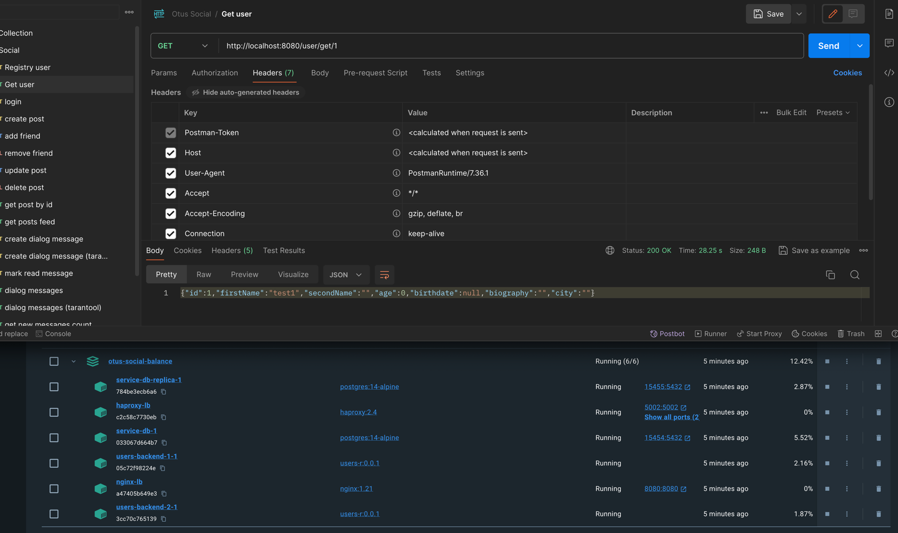
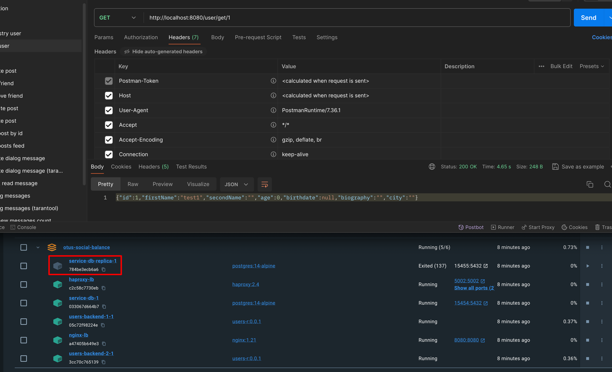
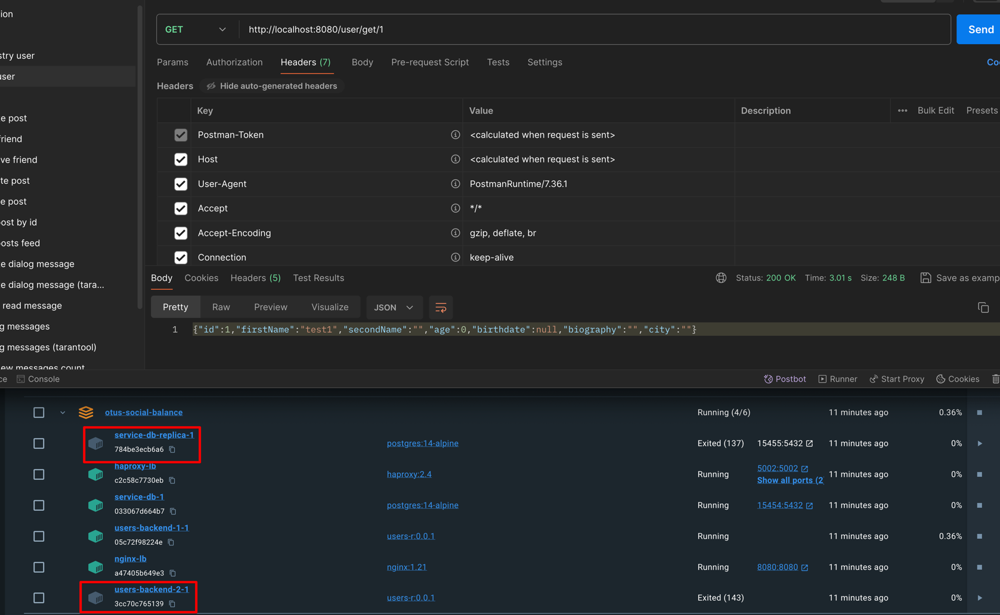

# Отчет по балансировке

### Постановка
В рамках домашнего задания необходимо настроит балансировку входящего http трафика между и балансировку запросов к базе
данных через haproxy.

### Реализация
Для реализации был составлен отдельный docker compose файл (docker-compose-balance.yml), который запускает следующие сервисы:
1) service-db - мастер базы данных postgres
2) service-db-replica - логическая реплика service-db
3) haproxy - осуществляет баланчировку подключений к базам данных service-db, service-db-replica
4) users-backend-1 и users-backend-2 - два инстанса модуля пользователей, которые через haproxy подключаются к базам данных
5) nginx - осуществляет балансировку входящего трафика между users-backend-1, users-backend-2

Конфигурацию haproxy можно посмотреть в файле `/infra/balance/haproxy.cfg`
Конфигурацию nginx можно посмотреть в файле `/infra/balance/nginx.conf`

Для упрощения реализации также были приняты следующие допущения:
1) При этом инициализация и наполнение базы осуществляется инициализационными скриптами, без использования инструментов миграции
2) модуль пользователей обращается к базе только с операциями чтенья (так как service-db-replica это логическая реплика и не может
обрабатывать запросы на изменения / добавление записей, и на уровне user-backend из-за использования haproxy нету возможности
определить в какую именно базу попадет запрос)

### Проверка балансировки
Были проведены проверены следующие сценарии:
1) Выключение одной из баз данных. Для этого после запуска сервисов в docker-compose один из контейнеров базы останавливался и с
помощью запросов через postman проверялось что rest запросы продолжают работать

Пример запроса когда все модули работают

Пример запроса когда одна база выключена

2) Выключение одного из модулей users-backend. Для этого после запуска сервисов в docker-compose один модулей останавливался и с 
помощью запросов через postman проверялось что rest запросы продолжают работать

Пример запроса когда все модули работают

Пример запроса когда одна база и один модуль users-backend выключена

