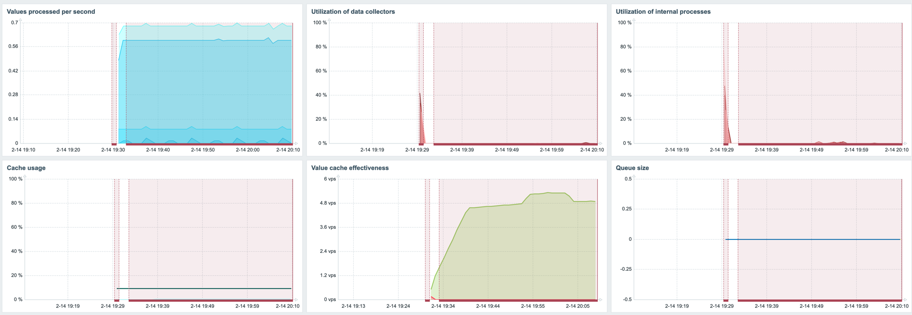
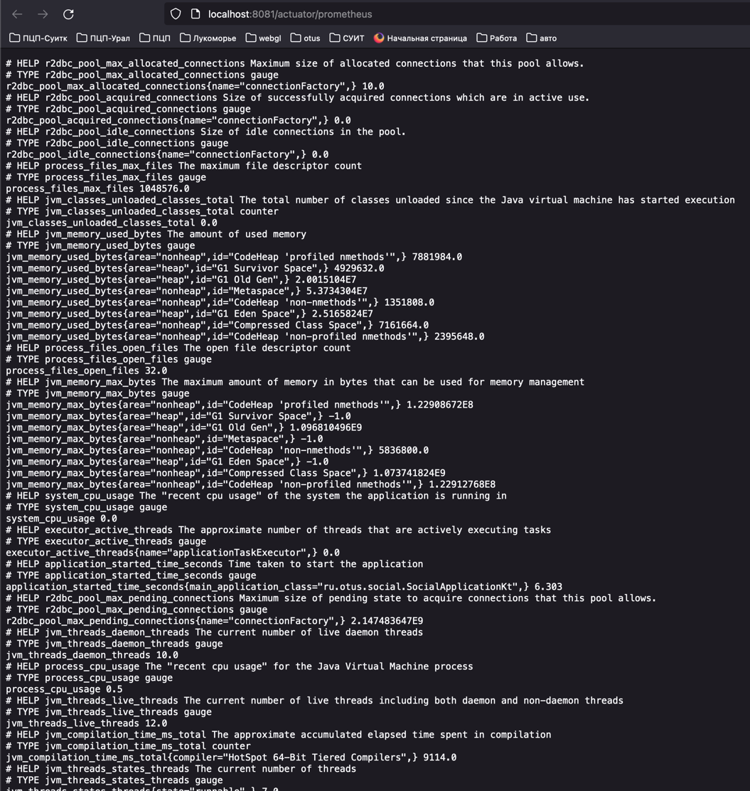
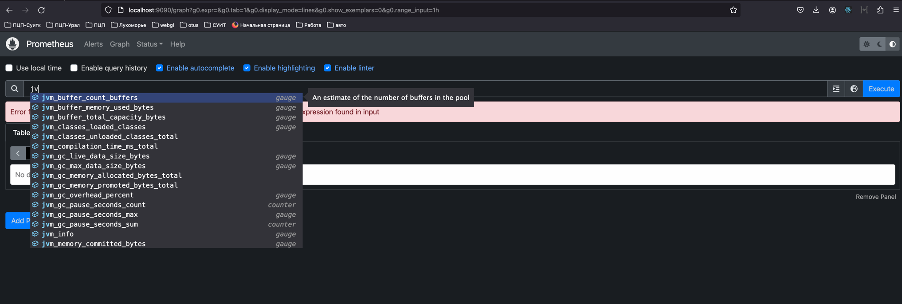
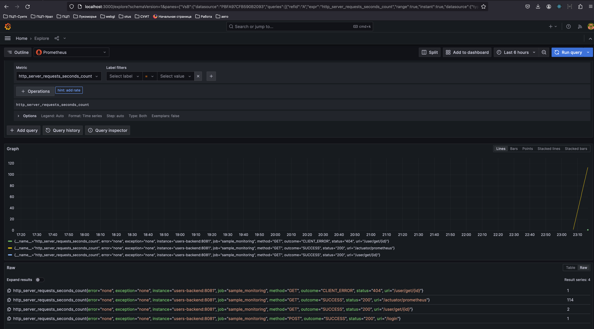
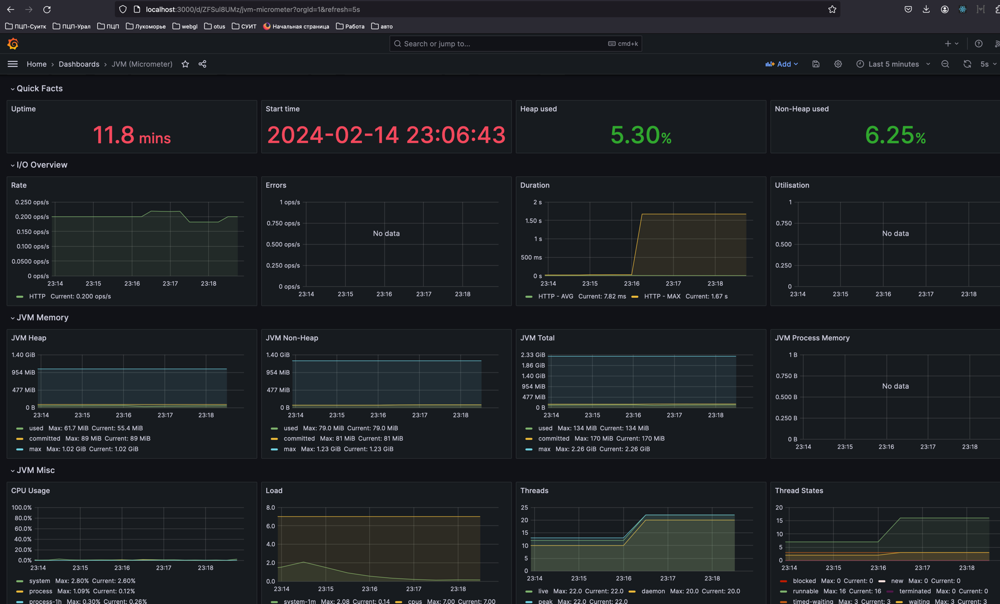
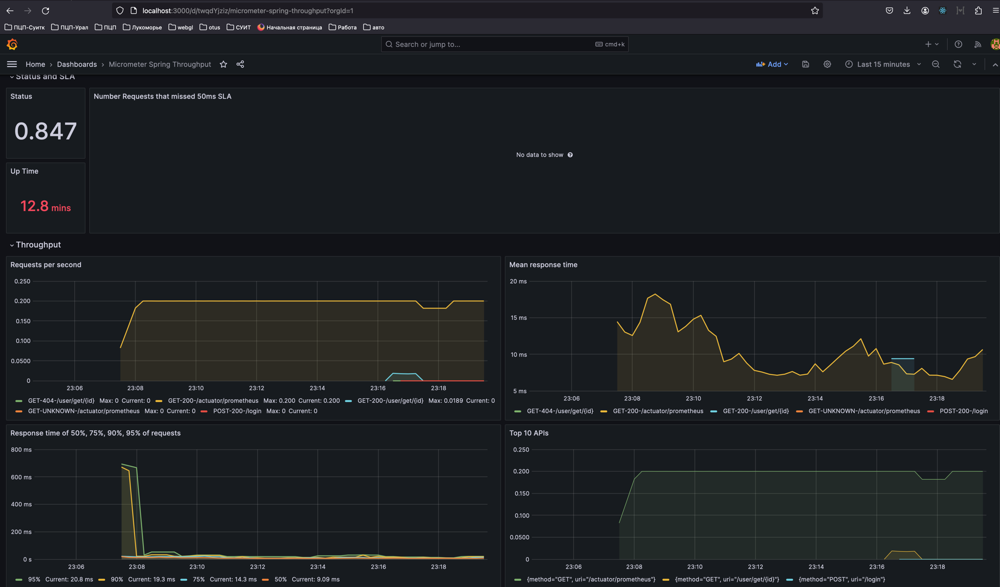

# Отчет по заданию мониторниг

### Постановка
Необходимо развернуть и настроить следующие инструменты мониторинга
- Zabbix (для мониторинга хоста)
- Prometheus (для сборка бизнес-метрик)
- Grafana (для организации дашбордов)

А также добавить экспорт бизнес-метрик из одного из сервисов и настроить отображение дашбордов в Grafana

### Реализация
Для запуска Zabbix, Prometheus и Grafana использовался docker
В качестве сервиса для настроики бизнес-метрик был выбран сервис пользователей

Пример мониторинга ресурсов с помощью zabbix

Для экспорта данных из сервиса пользователей в Prometheus использовались библиотеки micrometer и actuator, которые также предоставляют некоторые стандарнты метрики RED

Работу с собранными данными можно осуществлять в web интерфейсе Prometheus

Или в веб интерфейсе Grafana 

В Grafana было настроено два дашборда
1) для системных (технических) метрик 

2) а также для метрик по пользовательским запросам

