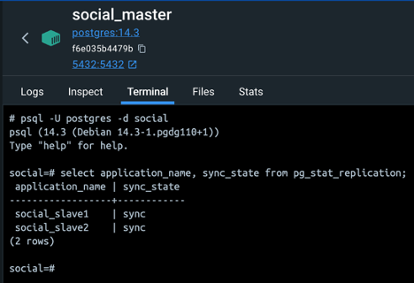
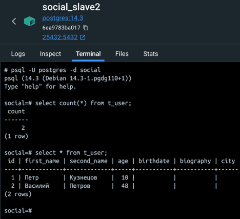

# Отчет по домашнему заданию репликация.

## Цель:
В результате выполнения ДЗ вы настроите синхронную репликацию, протестируете ее влияние на производительность системы и убедитесь, что теперь вы не теряете транзакции в случае аварии.
В данном задании тренируются навыки:
- обеспечение отказоустойчивости проекта;
- администрирование PostgreSQL;
- настройка репликации;
- проведение нагрузочных тестов.

## Описание/Пошаговая инструкция выполнения домашнего задания:
1.	Настраиваем асинхронную репликацию.
2.	Выбираем 2 запроса на чтение (/user/get/{id} и /user/search из спецификации) и переносим их на чтение со слейва.
3.	Делаем нагрузочный тест по методам (/user/get/{id} и /user/search из спецификации), которые перевели на слейв до и после репликации. Замеряем нагрузку мастера (CPU, la, disc usage, memory usage).
4.	Настроить 2 слейва и 1 мастер.
5.	Включить и настроить синхронную репликацию.
6.	Создать нагрузку на запись в любую тестовую таблицу. На стороне, которой нагружаем считать, сколько строк мы успешно записали.
7.	С помощью kill -9 убиваем мастер PosgtreSQL.
8.	Заканчиваем нагрузку на запись.
9.	Выбираем самый свежий слейв. Промоутим его до мастера. Переключаем на него второй слейв.
10.	Проверяем, есть ли потери транзакций.
       Результатом сдачи ДЗ будет в виде исходного кода на github и отчета в текстовом виде, где вы отразите как вы выполняли каждый из пунктов.

## Отчет:

### 1. асинхронная репликация.
   Для создания асинхронной репликации, аналогично примеру из лекции было развернуто 3 докер контейнера postgres

#### Настройка мастера:
- запуск контейнера осуществлялся командой _docker run -dit -v $PWD/social_master/:/var/lib/postgresql/data -e POSTGRES_PASSWORD=pass -p 5432:5432 --restart=unless-stopped --network=pgnet --name=social_master postgres:14.3_
- в файле _postgresql.conf_ выставлены следующие настройки

- создана роль replicator: _create role replicator with login replication password 'pass';_
- настроены разрешения в _pg_hba.conf_, для применение настроек контейнер был перезапущен

#### Создание реплик:
- для создания реплик с мастера был снят дамп: _pg_basebackup -D /social_slave -U replicator -v -P --wal-method=stream_
- созданный дам был скопирован в директории _social_slave1_ и _social_slave2_
- в директории обоих реплик был добавлен файл _standby.signal_
- в файле postgresql.conf обоих реплик была добавлена настройка _primary_conninfo_ с указанием параметров подключения к мастеру

#### Настройка асинхронной реплики:
- для настройки реплики в _postgresql.conf_ мастера были добавлены параметры _synchronous_commit_ и _synchronous_standby_names_

- с помощью системного представления _pg_stat_replication_ была проверена корректность настройки асинхронной реплики (также как в примере на лекции): _social_slave1_ в режиме синхронной репликации, а _social_slave2_ – в режиме асинхронной
 

#### Проверка репликации:
- для проверки репликации в мастере были созданы необходимые таблицы и в таблицу _t_user_ добавлена одна запись

- с помощью SQL запросов было проверено что данная запись появилась в обеих репликах

### 2. Настройка синхронной репликации
- для переключение обоих реплик в режим синхронной репликации в мастере была изменена настройка _synchronous_standby_names_ и с помощью _pg_reload_conf_ настройки пременены

- проверка в системном представлении _pg_stat_replication_ показала что обе реплики перешли в синхронный режим

- для проверки репликации в мастер была добавлена еще одна запись

- с помощью sql запросов было проверено что данная запись появилась в обеих репликах

### 3. Проведение нагрузочного тестирования
- для проведения нагрузочного тестирования в мастере было сгенерированно 10000 тестовых записей

- с помощью sql запроса было проверено что все добавленные записи появились в репликах

- далее в настройках приложения (_application.yml_) было изменено подключение с мастера на первый слейв
- после этого был запущен нагрузочный скрипт на jmeter (см *Test load.jmx*), который генерировал запросы _/user/get/{случайны идентификатор}_ и _/user/search_. Для создания нагрузки использовалось 10 параллельных потоков
- мониторинг ресурсов (CPU, памяти и так далее) показал что вся нагрузка перешла на первый слейв

### 4. Создание нагрузки на запись
- для создания нагрузки на запись, параллельно с процессом, настроенным на первую реплику был запущен еще один, с настройками в _application.yml_ на подключение к мастеру
- в новом процессе, работающим с мастером, была запущенна процедура по генерации дополнительных 10000 тестовых записей. Согласно данным мониторинга видно что по сравнению с ситуацией только чтенья из реплики появилась нагрузка на мастер (при этом примерно на четверть снизилась нагрузка на реплику, возможно это связно с тем, что все инстансы базы были реально запущены на одном компьютере)

- в произвольный момент мастер был аварино остановлен. При этом в логах процесса, создававшего нагрузку на запись была зафиксирована ошибка, а счетчик количества добавленных записей показывал **2319**

- после остановки мастера и выключения процесса нагрузки на запись было проверено количества записей в таблице _t_user_ в репликах. Запрос показал что таблица содержит **12320** записей, хотя счетчик процесса записи в момент остановки показывал **2319**, то есть на одну запись меньше. Возможно это связанно с особенностью асинхронной работы с базой (с помощью драйвера r2db), данный момент требует дополнительного исследования. Также не получилось добиться потери данных: делалось несколько попыток, но каждый раз в момент остановки мастера все данные доходили до реплик

### 5. Промоут слейва до мастера
- для промоута слейва до мастера были внесены изменения в _postgresql.conf_ в _social_slave1_ (настройки мастера) и _social_slave2_

- на _social_slave1_ выполнена команда _pg_promote_ и _pg_reload_conf_ для применения настроек

- аналогично на _social_slave2_ также была выполнена команда _pg_reload_conf_ для применения настроек

- с помощью системного представления в _social_slave1_ было проверено что _social_slave2_ теперь является его репликой

- также для проверки новой конфигурации репликации была добавлена еще одна тестовая запись в таблицу _t_user_

- в _social_slave2_ запросом было проверено что количество записей также увеличилось на единицу

- после завершения изменения конфигурации репликации снова был запущен мастер и запрос проверено количество записей в таблице t_user, оно оказалось равным **12320**, что соответствует количеству записей в таблице на момент остановки мастера: на одну запись больше чем по логам зафиксировал счетик и на одну запись меньше чем в репликах после последнего тестовой вставки в _social_slave1_

