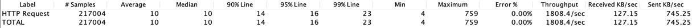
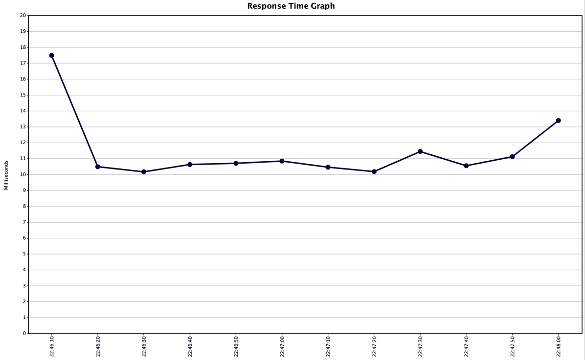
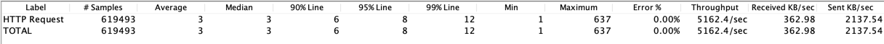
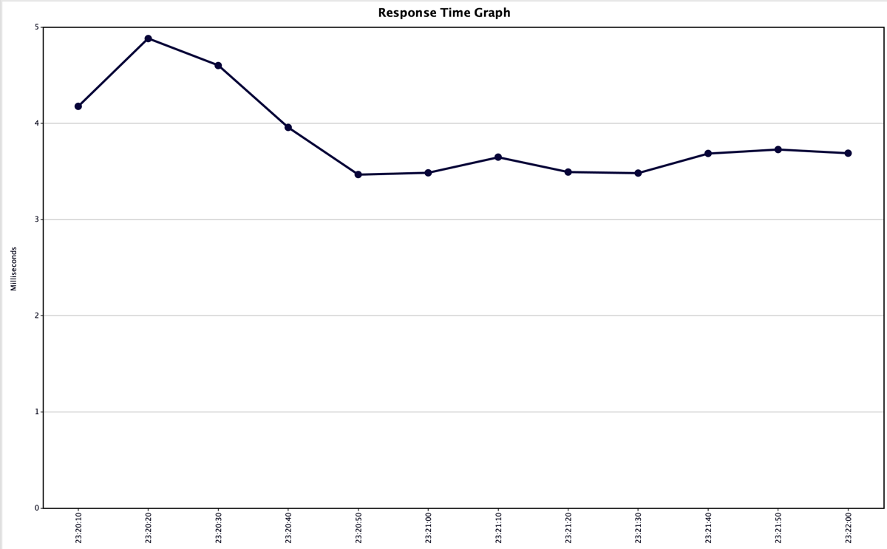

# Отчет по использованию in-memory БД tarantool.

### Постановка
Модуль диалогов использует citus для шардированного хранения пользовательских сообщений.
В рамках данного домашнего задания в качестве альтернативного инструмента хранения был использован 
tarantool. 

#### Детали реалзиации
1) В целях упрощения сравнения оба хранилища подключены одновременно, разные ендпоинты:
- /dialogs/{id}/send, /dialogs/{id}/list - работают с citus
- /dialogs/{id}/**t**/send, /dialogs/{id}/**t**/list - работают с tarantool 
2) Tarantool в отличие от citus не шардирован, однако на результаты нагрузочного тестирования это не
влияет, так как все запросы НГ попадают в один шард
3) Для сохранения и получения сообщений в tarantool используются хранимые процедуры _find_dialod_messages_, _add_dialod_messages_
и индекс _search_by_users_. Подробности можно посмотреть в файле _/infra/db/tarantool_init.lua_
4) Нагрузочное тестирование заключалось в выполнении запроса на создание сообщения со случайным 
текстом паралелльно 20 потоками в течении 20 минут
5) Приложение для подключения к tarantool в ленивом режиме (то есть при первом обращении) поднимает пул из 30
подключений, которые в дальнейшем переиспользовались

### Результат нагрузочного тестирования для postgres (citus)

### Результат нагрузочного тестирования для tarantool

Как и ожидалось, in-memory база показывает лучшую производительность (ведь в этом случае не требуется сохранять
данные на диск), средная скорость обработки запросов при сохранении сообщений через citus равно 10, в то время 
как при использовании tarantool всего 3 мс

Запросы можно посмотреть в постман коллекции _Otus Social.postman_collection.json_, план нагрузочного тестирования можоно посмотерть в файле _Test Plan.jmx_
Для запуска проекта можно использовать _docker-compose.yml_, например командой _docker-compose -p otus-social up --scale worker=2_

